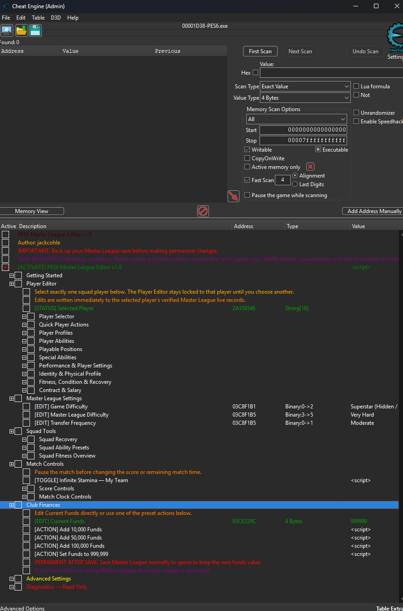
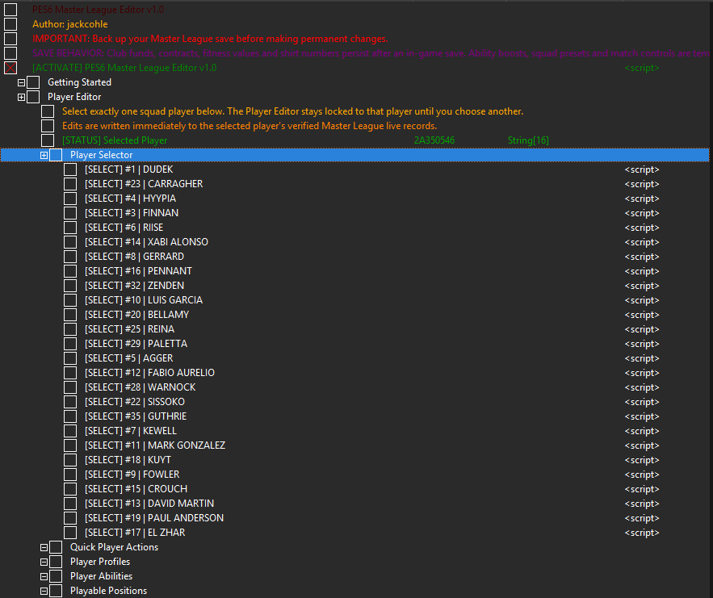
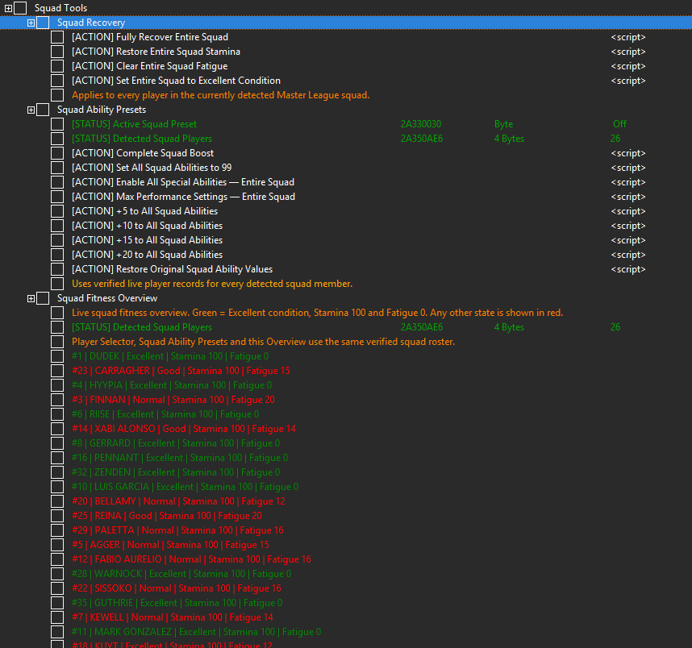

# PES6 Master League Editor v1.0

### Pro Evolution Soccer 6 Master League için kapsamlı Cheat Engine editörü

**Sürüm:** 1.0  
**Yazar:** jackcohle  
**Platform:** PC  
**Gereksinim:** Cheat Engine + Pro Evolution Soccer 6  
**Önemli:** PES6'ya bağlanmadan önce Cheat Engine'i **Yönetici Olarak Çalıştırın**.

[English](README.md) | **Türkçe**

### ⬇ İndir

**[En güncel stabil sürümü indir](https://github.com/jackcohle/PES6-Master-League-Editor/releases/latest)**

**Video / Tanıtım:** `https://www.youtube.com/watch?v=as4FTyxqqKM`

**SHA-256 — v1.0 kararlı CT**  
`ce9c35802e9a5aca2a29e2e273aa889eca41fcd30d75230796562fb3bfc44b1d`

> Ayrıntılı açıklamalar aşağıdadır. Kalıcı değişiklikler yapmadan önce Master League kayıt dosyanızın yedeğini alın.

---
## İçindekiler
- [Proje Hakkında](#proje-hakkinda)
- [Uyumluluk ve Test Edilen Sürümler](#uyumluluk)
- [Kurulum](#kurulum)
- [Önemli Kullanım Notları](#kullanim-notlari)
- [Ana Özellikler](#ana-ozellikler)
  - [1. Otomatik Master League Kadro Algılama](#1-kadro-algilama)
  - [2. Player Selector](#2-player-selector)
  - [3. Quick Player Actions](#3-quick-player-actions)
  - [4. Player Profiles](#4-player-profiles)
  - [5. Player Abilities](#5-player-abilities)
  - [6. Playable Positions](#6-playable-positions)
  - [7. Special Abilities](#7-special-abilities)
  - [8. Performance & Player Settings](#8-performance-settings)
  - [9. Identity & Physical Profile](#9-identity)
  - [10. Fitness, Condition & Recovery](#10-fitness)
  - [11. Contract & Salary](#11-contract)
  - [12. Squad Tools](#12-squad-tools)
  - [13. Squad Ability Presets](#13-squad-presets)
  - [14. Squad Fitness Overview](#14-fitness-overview)
  - [15. Master League Settings](#15-ml-settings)
  - [16. Club Finances](#16-finances)
  - [17. Match Controls](#17-match-controls)
  - [18. Score Controls](#18-score-controls)
  - [19. Match Clock Controls](#19-match-clock)
  - [20. Advanced Settings](#20-advanced)
  - [21. Diagnostics — Read Only](#21-diagnostics)
- [Kalıcı ve Geçici Değişiklikler](#kalici-gecici)
- [Güvenlik](#guvenlik)
- [v1.0 — İlk Kararlı Sürüm](#v10-release)
- [İçerik Özeti](#icerik-ozeti)
- [Lisans](#lisans)
- [Yazar](#author)

> GitHub masaüstü görünümünde başlıklardan oluşan **Outline** menüsünü de kullanabilirsiniz.

---

## Proje Hakkında
**PES6 Master League Editor**, Pro Evolution Soccer 6'nın Master League modu için hazırlanmış kapsamlı bir Cheat Engine tablosudur.

Projenin temel amacı yalnızca birkaç değeri değiştiren klasik bir cheat table oluşturmak değil; Master League kadrosunu otomatik olarak algılayan, doğru oyuncuyu güvenli şekilde seçebilen ve oyuncu/takım verilerini tek bir arayüz altında yönetebilen bir **Master League editörü** oluşturmaktır.

Tablonun ana bölümleri aynı doğrulanmış Master League kadrosunu kullanır:

- Player Selector
- Player Editor
- Squad Recovery
- Squad Ability Presets
- Squad Fitness Overview

Bu sayede farklı bölümlerin farklı oyuncu listelerine veya yanlış oyuncu kayıtlarına bağlanması önlenir.

Bazı Master League oyuncularının yetenek verileri standart oyuncu kaydından farklı bir bellek düzeninde bulunabilir. Böyle bir oyuncu ilk kez düzenlendiğinde kısa, tek seferlik bir doğrulama taraması yapılabilir. Doğru kayıt bulunduğunda adres güvenli biçimde önbelleğe alınır ve sonraki işlemler doğrudan bu doğrulanmış kayıt üzerinden uygulanır. Sistem belirli bir oyuncu adına veya Player ID değerine özel olarak yazılmamıştır.

[↑ Başa dön](#top)

---

## Uyumluluk ve Test Edilen Sürümler
v1.0 geliştirme ve test sürecinde iki farklı PES6 kurulumu üzerinde doğrulandı:

| Ortam | Test edilen oyun dosyası | Durum |
|---|---|---|
| **Standart / yamasız PES6** | `PES6.exe` | ✅ Test edildi |
| **PES 6 Original Season** yaması | `pes6.exe` | ✅ Test edildi |

Her iki oyun dosyası da **32-bit PE (x86)** yapısındadır ve **21,880,832 bayt** boyutundadır; ancak dosya içerikleri aynı değildir.

**SHA-256 — Standart PES6**  
`53263fb86b10b1bd2a9a962816c55ba23954e8f0596da80e8adebb4fead3295e`

**SHA-256 — PES 6 Original Season**  
`cd30427917be6a903ea4624147ca8506c7db5462a4a4e9f50ee8dd6c9d494628`

> Bu SHA-256 değerleri yalnızca v1.0'ın test edildiği oyun dosyalarını tanımlamak içindir. Editörün çalışması için dosya adınızın veya hash değerinizin birebir aynı olması gerekmez.

### Yama uyumluluğu

v1.0, yalnızca tek bir PES6 kurulumuna bağlı kalmayacak şekilde geliştirildi.

Test ve doğrulama şu anda **Standart / yamasız PES6** ve **PES 6 Original Season** ile sınırlıdır.

Diğer yamalarla uyumluluk **garanti edilmez**.

Ana oyuncu ve kadro sistemleri gerektiğinde çalışma sırasında adresleri doğrular ve geçersiz hedefleri yeniden bulur. Buna rağmen üçüncü taraf yamaların `pes6.exe` üzerinde yaptığı değişiklikler bazı özellikleri etkileyebilir.

[↑ Başa dön](#top)

---

## Kurulum
1. PES6'yı çalıştırın.
2. Cheat Engine'i **Yönetici Olarak Çalıştırın**.
3. Cheat Engine'i `pes6.exe` işlemine bağlayın.
4. `PES6-Master-League-Editor-v1.0-by-jackcohle.CT` dosyasını açın.
5. `[ACTIVATE] PES6 Master League Editor v1.0` seçeneğini etkinleştirin.
6. Master League kayıt dosyanızı yükleyin.
7. Takımın otomatik olarak algılanmasını bekleyin.
8. Tek oyuncu düzenlemek için `Player Selector` bölümünden oyuncuyu seçin.
9. Player Editor veya Squad Tools özelliklerini kullanın.

[↑ Başa dön](#top)

---

## Önemli Kullanım Notları
### Cheat Engine'i Yönetici Olarak Çalıştırın

PES6'ya bağlanmadan önce Cheat Engine'i **Yönetici Olarak Çalıştır** seçeneğiyle başlatın. Özellikle oyun da yönetici yetkisiyle çalışıyorsa bu, bağlanma ve belleğe yazma sırasında oluşabilecek izin sorunlarını azaltır.

### Player Selector kullanın

Tek bir oyuncuyu düzenlemeden önce oyuncuyu **Player Selector** üzerinden seçin. Player Editor ile yapılan oyuncu, kondisyon ve sözleşme düzenlemeleri doğrulanmış Master League kadrosuna göre çalışır.

### Bazı oyuncularda ilk işlem kısa sürebilir

Bazı Master League oyuncularının canlı yetenek kaydı standart düzenden farklı olabilir. Bu oyunculardan biri ilk kez seçildiğinde kısa bir doğrulama taraması yapılabilir. Doğru adres bulunduktan sonra sonuç önbelleğe alınır ve sonraki işlemler daha hızlı uygulanır.

### Squad Ability Presets oturum boyunca korunur

**Squad Ability Presets** geçicidir; ancak aynı Master League oturumu içindeki normal maç geçişlerinde seçili hazır ayar korunur. PES6 maçtan sonra takımın yetenek kayıtlarını yeniden oluşturursa hazır ayar yalnızca doğrulanmış kadro kayıtlarına tekrar uygulanır.

Takımı hazır ayar uygulanmadan önceki değerlere döndürmek için **Restore Original Squad Ability Values** kullanılabilir.

### Maç sonu ve şampiyonluk kutlaması güvenliği

Hazır ayar sistemi, aynı Player ID ile sonradan ortaya çıkan her geçici kayda artık otomatik olarak yazmaz. Böylece şampiyonluk kutlaması veya ara sahne sırasında kullanılan geçici kayıtlar normal oyuncu kaydı sanılmaz. Bu değişiklik kutlama anındaki çökme sorununu önlerken normal maçlar arasındaki hazır ayar devamlılığını korur.

Player Editor yazmaları da maç sonundaki güvenli olmayan geçişlerde geçici olarak durdurulur.

### Master League'den çıkıp tekrar girerken

Master League'den tamamen çıktıktan sonra yeniden girmeden önce **`[ACTIVATE]` işaretini kaldırıp tekrar etkinleştirin**. Bu işlem geçici oturum durumunu temizler ve yeni Master League girişinin temiz şekilde başlamasını sağlar.

### Transfer sonrası kadro

Transferden sonra eski kadro görünmeye devam ederse Master League ekranından çıkıp tekrar girin. Master League'den tamamen çıktıysanız yukarıdaki `[ACTIVATE]` sıfırlamasını da uygulayın.

### Match Controls kullanırken oyunu duraklatmak önerilir

Skor veya kalan süre üzerinde değişiklik yapmadan önce oyunu duraklatmak daha güvenlidir. **Add Home Goal / Add Away Goal** maç içindeki ESC istatistik ekranlarında da kullanılabilir. **Remaining Match Time (Raw) = 0** iken **Add / Remove / Reset** kullanmayın; bu değer uzatma dakikaları ve devre/maç geçiş pencerelerinde de 0 olabilir ve Raw tekrar pozitif olana kadar işlemler engellenir.

### Çok fazla yapay gol kaydı oluşturmayın

PES6'nın gol geçmişi ekranları tek maçta onlarca yapay kayıt için tasarlanmamıştır. Normal maç skorlarında **Add Home Goal / Add Away Goal** kullanın. Add Goal gerçek bir golcü kaydı oluşturur ancak bilinçli olarak **asist oluşturmaz**. Remove Goal ve Reset ise native gol geçmişini yeniden kurar ve etkilenen gol/asist maç istatistiklerini senkronize eder.

[↑ Başa dön](#top)

---

## Ana Özellikler

### 1. Otomatik Master League Kadro Algılama

Editör aktif hale getirildikten ve Master League yüklendikten sonra mevcut takım otomatik olarak algılanır.

Kadro algılandıktan sonra aynı oyuncu listesi:

**Player Selector**, **Squad Ability Presets** ve **Squad Fitness Overview** tarafından ortak olarak kullanılır.

Bu yapı özellikle transfer oyuncuları, kaleciler, genç oyuncular ve normal PES6 oyuncu veritabanındaki kayıtlardan farklı davranabilen Master League oyuncuları için önemlidir.

Boş kadro kapasitesi kullanıcıya oyuncu gibi gösterilmez; Player Selector gerçek takım oyuncularına odaklanır.

[↑ Başa dön](#top)

---

### 2. Player Selector

Player Editor'ı kullanmadan önce düzenlemek istediğiniz oyuncuyu **Player Selector** bölümünden seçin.

Bir oyuncu seçildiğinde:

- Player Editor seçilen oyuncuya kilitlenir.
- Oyuncunun gerçek Master League Player ID değeri kullanılır.
- Oyuncu adı doğrulanmış kadro ve oyuncu kayıtlarından bulunur.
- Yetenek verileri yüklenir.
- Kondisyon ve sözleşme kayıtları bulunur.
- Başka bir oyuncu seçilene kadar mevcut oyuncu hedef olarak kalır.

Player Editor aynı anda yalnızca **bir oyuncuyu** hedefler. Bu yapı yanlış oyuncunun düzenlenmesi riskini azaltır.

#### Özel canlı kayıt sistemi

Bazı oyuncular normal:

`Full Player Record → Current Ability Record`

yapısını kullanmaz.

Böyle bir oyuncu ilk kez düzenlendiğinde tablo doğru canlı yetenek kaydını bulmak için kısa bir doğrulama taraması yapabilir.

Doğru kayıt bulunduğunda adres güvenli biçimde önbelleğe alınır. Master League yeniden yüklendiğinde veya bellek düzeni değiştiğinde önbellekteki hedef artık geçerli değilse eski adres kullanılmaz; oyuncu yeniden doğrulanır.

[↑ Başa dön](#top)

---

### 3. Quick Player Actions

Seçili oyuncuya tek tıklamayla kapsamlı değişiklikler uygulayan dört hazır işlem bulunur.

#### Set All 26 Abilities to 99

Oyuncunun 26 temel yetenek değerinin tamamını **99** yapar.

Pozisyonlar, Special Abilities ve fiziksel bilgiler değiştirilmez.

#### Enable All Special Abilities

Seçili oyuncu için **23 Special Ability'nin tamamını** etkinleştirir.

26 temel yetenek değerini değiştirmez.

#### Max Performance Settings

Oyuncunun performansla ilgili ek ayarlarını maksimum seviyeye getirir:

- Consistency → 8
- Condition → 8
- Weak Foot Accuracy → 8
- Weak Foot Frequency → 8
- Injury Tolerance → A

Bu işlem 26 temel yetenek değerini değiştirmez.

#### Create Complete Superstar

Yukarıdaki üç işlemi tek adımda uygular:

- 26 Abilities → 99
- Tüm Special Abilities → aktif
- Consistency → 8
- Condition → 8
- Weak Foot Accuracy → 8
- Weak Foot Frequency → 8
- Injury Tolerance → A

Bu, seçili oyuncuyu tek tıklamayla maksimum seviyeye getirmek için tasarlanmıştır.

[↑ Başa dön](#top)

---

### 4. Player Profiles

Hazır oyuncu profilleri, oyuncuyu sadece "her şey 99" yapmak yerine belirli bir futbolcu rolüne göre yeniden yapılandırır.

Her profil:

- 26 temel yetenek için mevkiye göre hazırlanmış değerler kullanır.
- Uygun pozisyonları belirler.
- Registered Position ayarlar.
- Mevkiye uygun Special Abilities özelliklerini etkinleştirir.
- Consistency / Condition / Weak Foot / Injury değerlerini düzenler.

**Elite Wonderkid** profili istisnadır; oyuncunun mevcut pozisyonlarını korur.

#### Elite Centre Forward

Ana pozisyon: **CF**

Oynayabildiği pozisyonlar:

- CF
- SS

Aktif edilen önemli Special Abilities:

- Positioning
- Reaction
- Scoring
- 1-on-1 Scoring
- Post Player
- Line Position
- Middle Shooting
- Centre
- Penalties
- 1-Touch Pass
- Outside

Consistency 8, Condition 8, Weak Foot Accuracy 7, Weak Foot Frequency 7 ve Injury Tolerance A kullanır.

#### Elite Playmaker

Ana pozisyon: **AMF**

Pozisyonlar:

- CMF
- AMF
- SS

Special Abilities:

- Dribbling
- Tactical Dribbling
- Positioning
- Playmaking
- Passing
- Middle Shooting
- Side
- Centre
- 1-Touch Pass
- Outside

Weak Foot Accuracy değeri 8'e kadar çıkarılır.

#### Explosive Winger

Ana pozisyon: **WF**

Pozisyonlar:

- SMF
- WF
- SS

Özellikle hızlanma, sürat ve top sürme üzerine kuruludur.

Special Abilities:

- Dribbling
- Tactical Dribbling
- Positioning
- Reaction
- Scoring
- 1-on-1 Scoring
- Side
- 1-Touch Pass
- Outside

#### Complete Midfielder

Ana pozisyon: **CMF**

Pozisyonlar:

- DMF
- CMF
- AMF

Pas, dayanıklılık, takım oyunu ve iki yönlü orta saha özelliklerine odaklanır.

Special Abilities:

- Tactical Dribbling
- Positioning
- Playmaking
- Passing
- Middle Shooting
- 1-Touch Pass
- Marking
- Sliding
- Covering

#### Defensive Midfielder

Ana pozisyon: **DMF**

Pozisyonlar:

- CB
- DMF
- CMF

Savunma, tepki, dayanıklılık, mental güç ve takım oyunu ağırlıklıdır.

Special Abilities:

- Positioning
- Reaction
- Passing
- Centre
- Marking
- Sliding
- Covering
- D-Line Control

#### World-Class Centre Back

Ana pozisyon: **CB**

Pozisyonlar:

- CWP
- CB
- SB

Savunma, fiziksel güç, tepki, kafa vuruşu, sıçrama ve mental güç ağırlıklı bir profildir.

Special Abilities:

- Positioning
- Reaction
- Centre
- Marking
- Sliding
- Covering
- D-Line Control
- Long Throw

#### Elite Goalkeeper

Ana pozisyon: **GK**

Kalecilik ve kaleci performansı için özel olarak hazırlanmıştır.

Special Abilities:

- Positioning
- Reaction
- Penalty Stopper
- 1-on-1 Stopper
- Long Throw

#### Elite Wonderkid — Keep Current Position

Genç ve gelişime açık bir yıldız oyuncu profili olarak tasarlanmıştır.

Diğer profillerden farklı olarak:

**oyuncunun mevcut pozisyonlarını ve Registered Position değerini değiştirmez.**

Aktif edilen Special Abilities:

- Dribbling
- Tactical Dribbling
- Playmaking
- Passing
- 1-Touch Pass

Condition 8, Consistency 7, Weak Foot Accuracy 7, Weak Foot Frequency 7 ve Injury Tolerance A uygulanır.

---

<strong>Tüm Player Profiles için kullanılan 26 yetenek değerini göster</strong>

Yetenek sırası:

`Attack / Defense / Body Balance / Stamina / Top Speed / Acceleration / Response / Agility / Dribble Accuracy / Dribble Speed / Short Pass Accuracy / Short Pass Speed / Long Pass Accuracy / Long Pass Speed / Shot Accuracy / Shot Power / Shot Technique / Free Kick Accuracy / Curling / Heading / Jump / Technique / Aggression / Mentality / Goal Keeping / Team Work`

#### Elite Centre Forward
`94, 45, 88, 84, 88, 91, 93, 87, 88, 87, 78, 79, 73, 76, 94, 91, 94, 75, 82, 90, 87, 90, 90, 86, 50, 82`

#### Elite Playmaker
`90, 55, 78, 86, 84, 88, 86, 92, 95, 91, 96, 90, 95, 90, 84, 86, 88, 94, 96, 65, 70, 96, 75, 88, 50, 96`

#### Explosive Winger
`89, 50, 74, 88, 97, 98, 86, 94, 93, 98, 86, 88, 91, 92, 84, 85, 86, 78, 91, 70, 75, 90, 84, 82, 50, 86`

#### Complete Midfielder
`86, 82, 84, 94, 85, 85, 89, 86, 88, 85, 93, 91, 91, 90, 84, 88, 85, 86, 88, 78, 82, 90, 85, 92, 50, 96`

#### Defensive Midfielder
`72, 94, 90, 94, 78, 76, 94, 76, 78, 74, 88, 86, 87, 85, 70, 84, 72, 68, 72, 84, 91, 82, 86, 95, 50, 94`

#### World-Class Centre Back
`60, 97, 96, 88, 79, 75, 96, 70, 70, 68, 79, 82, 84, 86, 60, 88, 62, 55, 60, 94, 97, 75, 88, 96, 50, 90`

#### Elite Goalkeeper
`45, 95, 90, 78, 65, 68, 97, 75, 55, 50, 72, 78, 78, 82, 45, 86, 50, 55, 60, 70, 88, 70, 55, 96, 99, 88`

#### Elite Wonderkid
`84, 70, 78, 86, 90, 92, 84, 90, 88, 91, 86, 84, 84, 85, 82, 84, 83, 78, 83, 76, 80, 88, 82, 84, 55, 86`

---

### 5. Player Abilities

Seçili oyuncunun **26 temel PES6 yetenek değeri ayrı ayrı düzenlenebilir.**

Her alan oyuncunun oyun içindeki farklı bir yönünü etkiler:

- **Attack** — Oyuncunun genel hücum etkinliğini ve faydalı hücum bölgelerine katılımını etkiler.
- **Defense** — Oyuncunun genel savunma etkinliğini ve savunma pozisyonunu etkiler.
- **Body Balance** — Fiziksel mücadelede güç, denge ve rakip temasına dayanıklılığı etkiler.
- **Stamina** — Maç ilerledikçe oyuncunun fiziksel performansını ne kadar koruyabildiğini belirler.
- **Top Speed** — Oyuncunun ulaşabileceği maksimum koşu hızını belirler.
- **Acceleration** — Oyuncunun yüksek koşu hızına ne kadar çabuk ulaştığını belirler.
- **Response** — Boş top, seken top ve hızla değişen pozisyonlara verilen tepkiyi etkiler.
- **Agility** — Dönüş, yön değiştirme ve genel hareket çevikliğini etkiler.
- **Dribble Accuracy** — Top sürerken yakın kontrol ve top hakimiyetini etkiler.
- **Dribble Speed** — Oyuncunun top sürerken ne kadar hız koruyabildiğini belirler.
- **Short Pass Accuracy** — Kısa ve orta mesafeli pasların isabetini belirler.
- **Short Pass Speed** — Kısa ve orta mesafeli pasların hızını belirler.
- **Long Pass Accuracy** — Uzun pas, yön değiştirme pası ve ortaların isabetini belirler.
- **Long Pass Speed** — Uzun pas, yön değiştirme pası ve ortaların hızını belirler.
- **Shot Accuracy** — Şutların kaleye ne kadar isabetli yönlendirildiğini belirler.
- **Shot Power** — Şutların güç ve hızını belirler.
- **Shot Technique** — Ters vücut açısı, vole ve zor pozisyonlarda şut uygulama kalitesini etkiler.
- **Free Kick Accuracy** — Direkt serbest vuruşların isabetini belirler.
- **Curling** — Şut, frikik ve ortalara verilebilen falso miktarını etkiler.
- **Heading** — Kafa vuruşlarının isabet ve etkinliğini belirler.
- **Jump** — Oyuncunun hava toplarında ne kadar yükseldiğini belirler.
- **Technique** — İlk dokunuş, top kontrolü ve zor pozisyonlardaki teknik uygulama kalitesini etkiler.
- **Aggression** — PES6'da ağırlıklı olarak oyuncunun ileri çıkma ve hücuma katılma eğilimini etkiler.
- **Mentality** — Zor maç koşullarında oyuncunun mücadeleye devam etme ve tepki verme davranışını etkiler.
- **Goal Keeping** — Temel kalecilik etkinliğini belirler.
- **Team Work** — Topsuz destek, takım hareketi ve takım arkadaşlarıyla koordinasyonu etkiler.

Böylece hazır profil veya toplu işlem kullanmadan oyuncuyu tamamen elle düzenlemek mümkündür.

[↑ Başa dön](#top)

---

### 6. Playable Positions

Bir oyuncunun oynayabildiği pozisyonlar `Yes / No` seçeneğiyle ayrı ayrı açılıp kapatılabilir.

- **GK — Goalkeeper** — Oyuncunun kaleci olarak kullanılabilmesini sağlar.
- **CWP — Sweeper** — Oyuncunun savunma çizgisinin arkasında libero olarak kullanılabilmesini sağlar.
- **CB — Centre Back** — Oyuncunun stoper olarak kullanılabilmesini sağlar.
- **SB — Side Back** — Oyuncunun sağ veya sol bek olarak kullanılabilmesini sağlar.
- **DMF — Defensive Midfielder** — Oyuncunun savunma önünde defansif orta saha olarak kullanılabilmesini sağlar.
- **WB — Wing Back** — Oyuncunun savunma ve geniş alan hücumu yapan wing-back olarak kullanılabilmesini sağlar.
- **CMF — Centre Midfielder** — Oyuncunun merkez orta saha olarak kullanılabilmesini sağlar.
- **SMF — Side Midfielder** — Oyuncunun sağ veya sol kenar orta saha olarak kullanılabilmesini sağlar.
- **AMF — Attacking Midfielder** — Oyuncunun forvetlerin arkasında hücumcu orta saha olarak kullanılabilmesini sağlar.
- **WF — Wing Forward** — Oyuncunun ileri seviyede geniş alanda kanat forvet olarak kullanılabilmesini sağlar.
- **SS — Second Striker** — Oyuncunun ana forvetin yanında veya arkasında ikinci forvet olarak kullanılabilmesini sağlar.
- **CF — Centre Forward** — Oyuncunun ana merkez santrfor olarak kullanılabilmesini sağlar.

Oyuncunun ana **Registered Position** değeri Performance & Player Settings bölümünden ayrıca düzenlenir.

[↑ Başa dön](#top)

---

### 7. Special Abilities

PES6'daki **23 Special Ability** özelliğinin her biri `Yes / No` ile ayrı ayrı açılıp kapatılabilir.

- **Dribbling** — Oyuncunun top sürerek rakip geçme etkinliğini geliştirir.
- **Tactical Dribbling** — Dar alanlarda kontrollü top sürme ve top saklama etkinliğini geliştirir.
- **Positioning** — Oyuncunun aktif oyun içinde faydalı pozisyonlar bulma davranışını geliştirir.
- **Reaction** — Hücum fırsatları ve boş toplara hızlı reaksiyon verme davranışını geliştirir.
- **Playmaking** — Hücum organizasyonu kurma ve pas seçeneği oluşturma davranışını geliştirir.
- **Passing** — Temel pas değerlerine ek olarak özel pas davranışlarını geliştirir.
- **Scoring** — Oyuncunun gol pozisyonlarındaki etkinliğini geliştirir.
- **1-on-1 Scoring** — Kaleciyle karşı karşıya pozisyonlarda bitiricilik etkinliğini geliştirir.
- **Post Player** — Sırtı dönük top alma, top saklama ve bağlantı oyunu etkinliğini geliştirir.
- **Line Position** — Savunma çizgisi üzerinde boşluk arama ve arkaya koşu davranışını geliştirir.
- **Middle Shooting** — Orta ve uzun mesafeden şut kullanımını ve etkinliğini geliştirir.
- **Side** — Geniş hücum bölgelerindeki uygunluk ve hareket davranışını geliştirir.
- **Centre** — Merkez hücum bölgelerindeki uygunluk ve hareket davranışını geliştirir.
- **Penalties** — Penaltı vuruşlarındaki etkinliği geliştirir.
- **1-Touch Pass** — Tek dokunuşla temiz ve etkili pas yapma davranışını geliştirir.
- **Outside** — Uygun durumlarda ayağın dışıyla pas ve şut kullanımını geliştirir.
- **Marking** — Rakibi takip etme ve markaj altında tutma etkinliğini geliştirir.
- **Sliding** — Kayarak müdahale etkinliğini geliştirir.
- **Covering** — Takım arkadaşı pozisyonunu terk ettiğinde savunma boşluğunu kapatma davranışını geliştirir.
- **D-Line Control** — Savunma çizgisinin organizasyonuna olan etkiyi geliştirir.
- **Penalty Stopper** — Kalecinin penaltılara karşı kurtarış etkinliğini geliştirir.
- **1-on-1 Stopper** — Kalecinin bire bir pozisyonlardaki kurtarış etkinliğini geliştirir.
- **Long Throw** — Oyuncunun daha uzun ve güçlü taç atışları kullanabilmesini sağlar.

[↑ Başa dön](#top)

---

### 8. Performance & Player Settings

Oyuncunun 26 temel yeteneği dışında kalan performans ve stil ayarları da düzenlenebilir.

#### Preferred Foot
- Right / Left

Oyuncunun ağırlıklı olarak hangi ayağını kullandığını belirler.

#### Free Kick Style
- Raw 0–15

Free Kick Accuracy değerini değiştirmeden oyuncunun frikik animasyon/stil indeksini değiştirir.

#### Penalty Kick Style
- Style 1–8

Oyuncunun penaltı vuruşu animasyon/stilini değiştirir.

#### Dribbling Style
- Style 1–4

Oyuncunun top sürme animasyon/stilini değiştirir.

#### Drop Kick Style
- Style 1–4

Kalecinin degaj animasyonunu ve stilini değiştirir.

#### Registered Position
12 PES6 pozisyonundan biri seçilebilir.

PES6'nın oyuncu rolü ve kadro bilgileri için kullandığı ana mevkiyi belirler.

#### Consistency
- 1–8

Oyuncunun maçtan maça ne kadar istikrarlı performans gösterdiğini etkiler.

#### Condition
- 1–8

PES6'nın oyuncunun maçtan maça form eğilimi için kullandığı değeri belirler.

#### Weak Foot Accuracy
- 1–8

Oyuncunun zayıf ayağını ne kadar isabetli kullanabildiğini belirler.

#### Weak Foot Frequency
- 1–8

Oyuncunun zayıf ayağını kullanmaya ne kadar yatkın olduğunu belirler.

#### Injury Tolerance
- C
- B
- A

Oyuncunun sakatlığa dayanıklılık seviyesini belirler.

#### Favoured Side
- Raw 0–3

PES6'nın taraf/kanat tercihi için kullandığı ham değeri değiştirir.

[↑ Başa dön](#top)

---

### 9. Identity & Physical Profile

Oyuncunun fiziksel ve kimlik bilgileri Player Editor içinden düzenlenebilir.

#### Height
148–211 cm

Seçili oyuncunun kayıtlı boy değerini değiştirir.

#### Weight
Raw 0–127

Kilogram göstermek yerine PES6'nın kodlanmış ağırlık değerini değiştirir.

#### Skin Colour
Raw 0–3

PES6'nın kullandığı ham ten rengi kategorisini değiştirir.

#### Age
15–46

Oyuncunun Master League içindeki kayıtlı yaş değerini desteklenen aralıkta değiştirir.

#### Nationality
Oyuncunun milliyetini orijinal PES6 ülke listesinden seçmeyi sağlar.
Ham sayı kodları yerine ülke isimleri doğrudan gösterilir.

#### Shirt Number
1–99

Seçili oyuncunun mevcut Master League kadro forma numarasını değiştirir.

Aynı forma numarasını birden fazla oyuncuya vermemek tavsiye edilir.

[↑ Başa dön](#top)

---

### 10. Fitness, Condition & Recovery

Player Editor içinde seçili oyuncunun Master League kondisyon bilgileri doğrudan düzenlenebilir.

#### Match Condition

Seçili oyuncunun mevcut maç kondisyonunu değiştirir.

Seçenekler:

- Excellent
- Good
- Normal
- Poor
- Terrible

#### Pre-Match Stamina
0–100

Seçili oyuncunun maç öncesi dayanıklılık seviyesini değiştirir.

#### Accumulated Fatigue
0–100

Seçili oyuncunun birikmiş Master League yorgunluk değerini değiştirir.

Bu değerlerden biri değiştirildiğinde **Squad Fitness Overview otomatik olarak güncellenir**.

Ayrıca dört hızlı işlem bulunur:

#### Fully Recover Selected Player

Aynı anda:

- Condition → Excellent
- Stamina → 100
- Fatigue → 0

Seçili oyuncuyu tek işlemle tamamen toparlar.

#### Restore Selected Player Stamina

Yalnızca `Stamina → 100` yapar; Fatigue ve Condition değerlerini değiştirmez.

#### Clear Selected Player Fatigue

Yalnızca `Fatigue → 0` yapar; Stamina ve Condition değerlerini değiştirmez.

#### Set Selected Player to Excellent Condition

Yalnızca `Condition → Excellent` yapar; Stamina ve Fatigue değerlerini değiştirmez.

Bu kondisyon değerleri Master League oyun içinden kaydedildiğinde kayıt dosyasına yazılabilir.

[↑ Başa dön](#top)

---

### 11. Contract & Salary

Mevcut Master League kadrosundaki seçili oyuncunun sözleşme bilgileri düzenlenebilir.

#### Yearly Salary

Oyuncunun Master League sözleşme kaydında tutulan yıllık maaş değerini değiştirir.

Oyunun bazı ekranlarında oyuncunun yanında görünen yetenek değerine bağlı sayı, kayıtlı yıllık maaşla aynı değildir.

#### Contract Years Remaining

Seçili oyuncunun sözleşmesinde kalan yıl sayısını değiştirir.

Seçenekler:

- 0 Years
- 1 Year
- 2 Years
- 3 Years
- 4 Years
- 5 Years

Maaş ve sözleşme değişikliklerini korumak için Master League'i oyun içinden kaydedin.

[↑ Başa dön](#top)

---

### 12. Squad Tools

Player Editor tek bir oyuncuyu düzenlerken **Squad Tools** algılanan Master League kadrosunun tamamına işlem uygular.

#### Squad Recovery

Algılanan kadronun tamamına kondisyon işlemleri uygulanabilir.

#### Fully Recover Entire Squad

Tüm takım için:

- Condition → Excellent
- Stamina → 100
- Fatigue → 0

#### Restore Entire Squad Stamina

Tüm oyuncular:

`Stamina → 100`

#### Clear Entire Squad Fatigue

Tüm oyuncular:

`Fatigue → 0`

#### Set Entire Squad to Excellent Condition

Tüm oyuncular:

`Condition → Excellent`

Squad Recovery, Player Selector ile aynı doğrulanmış kadro listesini kullanır.

[↑ Başa dön](#top)

---

### 13. Squad Ability Presets

Tek tek oyuncu seçmeden algılanan Master League kadrosunun tamamına hazır ayar uygulanabilir.

**Active Squad Preset** alanında seçili hazır ayarın adı, oyuncu sayacında ise işlem için doğrulanmış kaç kadro oyuncusu bulunduğu gösterilir.

#### Complete Squad Boost

Tüm kadroya şu işlemleri uygular:

- 26 Abilities → 99
- All 23 Special Abilities → enabled
- Max Performance Settings → enabled

Kısaca:

`All Abilities 99 + All Special Abilities + Max Performance`

#### Ultimate Squad by Position

Bütün oyuncuları aynı değerlere çekmek yerine mevkilere göre çok güçlü bir kadro oluşturur.

Oyuncular **Registered Position** değerine göre şu gruplarda değerlendirilir:

- **GK**
- **DEF**
- **MID**
- **FWD**

Her gruba mevkiye uygun yetenek değerleri, performans ayarları ve Special Abilities uygulanır. Oyuncunun **Registered Position** ve **Playable Positions** değerleri değiştirilmez.

#### Set All Squad Abilities to 99

Algılanan tüm kadro oyuncularının yalnızca 26 temel yetenek değerini 99 yapar.

#### Enable All Special Abilities — Entire Squad

26 temel yetenek değerini değiştirmeden tüm kadro oyuncularında 23 Special Ability'nin tamamını etkinleştirir.

#### Max Performance Settings — Entire Squad

Kadrodaki tüm oyuncular için Consistency, Condition, Weak Foot ve Injury Tolerance ayarlarını en yüksek seviyeye getirir.

#### +5 / +10 / +15 / +20 Ability Boosts

Her oyuncunun mevcut 26 yetenek değerine seçilen miktarı ekler ve sonuçları 99 ile sınırlar. Maçtan sonra PES6 takım kayıtlarını yeniden oluşturduğunda aynı artış tekrar tekrar üst üste eklenmez; seçili hazır ayarın beklenen değerleri yeniden uygulanır.

#### Restore Original Squad Ability Values

Etkin hazır ayar uygulanmadan önce yakalanan takım yetenek değerlerini geri yükler.

#### Oturum boyunca koruma ve kutlama güvenliği

**Squad Ability Presets** geçicidir; ancak aynı Master League oturumu içindeki normal maçlar arasında seçili hazır ayar korunur. PES6 maçtan sonra doğrulanmış takım kayıtlarını toplu olarak yeniden oluşturursa hazır ayar bu kayıtlar üzerinde yeniden kurulur.

Bu sistem özellikle **sonradan ortaya çıkan aynı Player ID'li geçici kayıtlara hazır ayarı tekrar yazmaz**. Böylece şampiyonluk kutlaması veya ara sahne sırasında kullanılan geçici kayıtlar normal oyuncu kaydı sanılmaz ve kutlama anındaki çökme sorunu önlenir.

Squad Ability Presets, Player Selector ve Squad Fitness Overview ile aynı doğrulanmış Master League kadrosunu kullanır.

[↑ Başa dön](#top)

---

### 14. Squad Fitness Overview

Takımın kondisyon durumunu tek ekranda takip etmek için hazırlanmış kadro görünümüdür.

Her oyuncu için:

- Shirt Number
- Player Name
- Condition
- Stamina
- Fatigue

görüntülenir.

#### Renk sistemi

Bir oyuncunun satırı **yalnızca üç koşulun tamamı sağlandığında yeşildir:**

**Condition = Excellent**  
**Stamina = 100**  
**Fatigue = 0**

Bu üç şarttan herhangi biri sağlanmıyorsa oyuncu **kırmızı** gösterilir.

Player Editor'da Condition, Stamina veya Fatigue değiştirildiğinde Squad Fitness Overview otomatik olarak güncellenir.

Bu sayede takımda kimlerin tam olarak hazır olduğu tek bakışta görülebilir.

[↑ Başa dön](#top)

---

### 15. Master League Settings

Master League'e ait bazı genel oyun ayarları doğrudan düzenlenebilir.

#### Game Difficulty

Maç içi yapay zekâ zorluk seviyesini değiştirir:

- Beginner
- Amateur
- Regular
- Professional
- Top Player
- Superstar — Hidden / 6-Star

Bu bölüm PES6'nın gizli **Superstar / 6-Star** zorluk seviyesine de erişim sağlar.

#### Master League Difficulty

Master League'in yönetim ve ekonomik zorluk seviyesini değiştirir:

- Very Easy
- Easy
- Normal
- Hard
- Very Hard

#### Transfer Frequency

Master League'deki transfer hareketliliğinin sıklığını değiştirir:

- Low
- Moderate
- High

#### Match Time (PES6 Native)

PES6'nın kendi maç süresi ayarını doğrudan düzenler:

- 5 Minutes
- 10 Minutes
- 15 Minutes
- 20 Minutes
- 25 Minutes
- 30 Minutes

#### Custom Match Time

Maç başlamadan önce şu ek süre seçeneklerini sunar:

- PES6 Native
- 3 Minutes
- 7 Minutes
- 12 Minutes

**3 / 7 / 12 Minutes** seçildiğinde gerekli temel PES6 süresi otomatik olarak ayarlanır. Daha sonra **Match Time (PES6 Native)** elle değiştirilirse iki ayarın birbiriyle çakışmaması için Custom Match Time otomatik olarak **PES6 Native** seçeneğine döner.

Bu iki süre ayarı yalnızca **Master League menü ekranında**, maç başlamadan önce kullanılmalıdır. Maç başladıktan sonra süre ayarları kilitlenir ve devam eden maçın süresi yalnızca **Remaining Match Time (Raw)** üzerinden düzenlenebilir.

[↑ Başa dön](#top)

---

### 16. Club Finances

Master League kulüp bütçesi düzenlenebilir.

#### Current Funds

Mevcut bütçe değerini doğrudan manuel olarak değiştirebilirsiniz.

Hazır Actionlar:

#### Add 10,000 Funds
Mevcut bütçeye +10.000 ekler.

#### Add 50,000 Funds
+50.000 ekler.

#### Add 100,000 Funds
+100.000 ekler.

#### Set Funds to 999,999
Bütçeyi doğrudan 999.999 yapar.

Funds değişikliğinin kalıcı olması için Master League'i oyun içinden kaydetmeniz gerekir. Kaydetmeden çıkılırsa değişiklik kaybolur.

[↑ Başa dön](#top)

---

### 17. Match Controls

Bu bölüm devam eden maç sırasında kullanılabilen kontrolleri içerir.

Skor veya kalan süre üzerinde değişiklik yapmadan önce oyunu duraklatmak önerilir. **Add Goal** işlemleri maç içindeki ESC istatistik ekranlarında da çalışır. Skor ve süre işlemleri devre arası, maç sonu ve kutlama geçişlerinde engellenir.

#### Infinite Stamina — My Team

Kendi Master League takımınızın maç içindeki Stamina değerinin azalmasını engeller.

Editör, Master League takımınızın o maçta ev sahibi mi deplasman mı olduğunu otomatik olarak belirler. Böylece özellik skor tabelasının sabit bir tarafına değil, doğrudan sizin takımınıza uygulanır.

[↑ Başa dön](#top)

---

### 18. Score Controls

Score Controls, skor tabelası ile native gol geçmişini ve oyuncu maç istatistiklerini birbiriyle senkronize tutacak şekilde çalışır.

#### Home Score / Away Score

Mevcut Home ve Away skorlarını yalnızca bilgi amaçlı gösterir. Bu satırlar oyunun gerçek skor adresine doğrudan bağlı değildir; Cheat Engine'de Value alanına elle farklı bir sayı yazmak **oyun skorunu değiştirmez** ve gösterilen değer kısa süre içinde gerçek skora geri döner.

#### [ACTION] Add Home Goal

PES6'nın native gol/istatistik yolunu kullanarak Ev sahibi tarafına bir gol ekler. O anda gerçekten sahada olan **bir saha oyuncusu** golcü olarak seçilir, Ev sahibi skoru artırılır, golcünün maç ve Master League gol istatistiği güncellenir ve PES6'nın native gol geçmişi kaydı oluşturulur.

Eklenen gol bilinçli olarak **asistsizdir** (`FF = no assistant`). Kaleciler rastgele golcü seçiminden çıkarılır.

#### [ACTION] Add Away Goal

Deplasman tarafında aynı asistsiz native gol mantığını kullanır: gerçek bir saha oyuncusu golcü seçilir, asist oluşturulmaz, skor/istatistikler senkronize güncellenir ve native gol geçmişi kaydı eklenir.

#### [ACTION] Remove Home Goal / Remove Away Goal

Seçilen skor tarafındaki **en son eşleşen golü** kaldırır. Skor 1 azaltılır, ilgili native gol geçmişi kaydı silinir ve golcünün istatistiği buna göre düşürülür. Silinen kayıt doğal PES6 golü olup asist içeriyorsa ilgili asist istatistiği de kaldırılır. Skor 0'ın altına düşmez.

#### [ACTION] Reset Score to 0–0

Tüm native gol geçmişi kayıtlarını kaldırarak maçı 0–0'a getirir ve bu gollere bağlı gol/asist maç istatistiklerini temizler. Gol dışındaki Game History olayları korunur.

Buradaki Home/Away ifadeleri takım adını değil, skor tabelasındaki ev sahibi/deplasman tarafını belirtir. **Add Home Goal / Add Away Goal** maç içindeki ESC istatistik ekranlarında da kullanılabilir.

> **Önemli:** **Remaining Match Time (Raw) = 0** iken **Add / Remove / Reset** kullanmayın. Raw=0; uzatma dakikalarını, devre arasını, maç sonunu ve kutlama/devre geçiş pencerelerini de kapsayabilir. Raw tekrar pozitif olana kadar Score Controls bilinçli olarak engellenir.

> PES6'nın gol geçmişi ekranları normal maç skorları için tasarlanmıştır. Tek maçta onlarca yapay gol kaydı oluşturmanız önerilmez.

[↑ Başa dön](#top)

---

### 19. Match Clock Controls

Üç süre kontrolü birbiriyle bağlantılı çalışır:

`Match Time (PES6 Native) ↔ Custom Match Time ↔ Remaining Match Time (Raw)`

#### Match Time (PES6 Native)

PES6'nın standart **5 / 10 / 15 / 20 / 25 / 30 dakika** maç süresi ayarıdır ve maç başlamadan önce kullanılır.

#### Custom Match Time

Maç başlamadan önce **PES6 Native**, **3 Minutes**, **7 Minutes** veya **12 Minutes** seçilebilir.

3 / 7 / 12 dakika seçildiğinde gereken temel PES6 süresi otomatik olarak ayarlanır. **Match Time (PES6 Native)** daha sonra elle değiştirilirse Custom Match Time otomatik olarak **PES6 Native** seçeneğine döner.

Maç öncesi süre ayarlarından biri değiştirildiğinde önceki maçtan kalmış bir **Remaining Match Time (Raw)** dondurma durumu varsa serbest bırakılır. Böylece eski bir canlı saat ayarı yeni maç süresine taşınmaz.

Başlama düdüğünden sonra **Match Time (PES6 Native)** ve **Custom Match Time** kilitlenir; devam eden maçın süresini yeniden ölçeklemez veya değiştirmez.

#### Remaining Match Time (Raw) — Edit / Freeze

Maç başladıktan sonra kullanılabilen canlı saat kontrolüdür. Kalan ham süre doğrudan düzenlenebilir. Cheat Engine satırı işaretlenirse mevcut değer dondurulur; işaret kaldırıldığında saat tekrar akmaya devam eder.

3 / 7 / 12 dakikalık özel sürelerden biri etkinse, o maç için izin verilen aralığın dışındaki ham süre girişleri reddedilir. Yalnızca maç öncesi seçim kutusunu değiştirmek bu uyarıyı tetiklemez.

#### End Current Period

Onay alındıktan sonra kalan ham süreyi 0 yapar ve mevcut devreyi/maç bölümünü hemen bitirebilir.

Editör oturumu sıfırlandığında Remaining Match Time (Raw) üzerindeki dondurma durumu kaldırılır. Master League'den tamamen çıktıktan sonra yeniden girmeden önce `[ACTIVATE]` işaretini kaldırıp tekrar etkinleştirin.

[↑ Başa dön](#top)

---

### 20. Advanced Settings

Bu bölüm normal kullanım için gerekli değildir. Özel bir sorun çözmeye çalışmıyorsanız varsayılan değerlerde bırakmanız önerilir.

#### Editor Runtime
Varsayılan: **Enabled**

Editörün ana çalışma döngüsünü açıp kapatır. Devre dışı bırakıldığında normal oyuncu/kadro algılama ve canlı güncelleme işlemleri durur.

#### Auto-Follow Player Resolver
Varsayılan: **Enabled**

Player Selector ile bir oyuncu elle kilitlenmemişse Player Editor'ın PES6 tarafından o anda çözümlenen oyuncuyu otomatik olarak takip edip etmeyeceğini belirler.

#### Instant Live Write-Back
Varsayılan: **Enabled**

Player Editor'da yapılan değişikliklerin seçili oyuncunun doğrulanmış canlı kaydına anında uygulanıp uygulanmayacağını belirler.

#### Selection Stability Checks
Varsayılan: **2 hits**

1–10 arasında ayarlanabilir. Otomatik olarak bulunan oyuncunun hedef kabul edilmeden önce kaç kez üst üste aynı ve geçerli olarak görülmesi gerektiğini belirler.

#### Legacy Master League Mode Check
Varsayılan: **Disabled**

Eski Master League doğrulama yöntemini uyumluluk ve sorun giderme amacıyla açar. Normal kullanımda gerekli değildir.

[↑ Başa dön](#top)

---

### 21. Diagnostics — Read Only

Bu bölüm yalnızca sorun giderme ve teknik inceleme içindir. Normal kullanımda değerleri değiştirmeniz gerekmez.

- **Last Resolver Player ID** — PES6'nın oyuncu çözümleyicisinin en son bildirdiği Player ID değerini gösterir.
- **Selected Player Record Address** — Player Editor'ın seçili oyuncu için kullandığı kayıt adresini gösterir.
- **Live Write Counter** — Player Editor tarafından doğrulanmış canlı kayda kaç yazma işlemi yapıldığını gösterir.
- **Selected Contract Record Address** — Seçili oyuncunun Master League sözleşme kaydı adresini gösterir.
- **Requested Player ID** — İstenen kadro yuvasında beklenen Player ID değerini gösterir.
- **Selected Roster Slot** — Player Selector tarafından o anda kilitlenmiş kadro yuvasını gösterir.
- **Selected Player ID Occurrences** — Seçili Player ID değerinin algılanan kadro verisinde kaç kez geçtiğini gösterir.

Bu bilgiler farklı PES6 oyun dosyalarını/yamalarını test ederken veya beklenmeyen oyuncu kayıtlarını incelerken yararlıdır.

[↑ Başa dön](#top)

---

## Kalıcı ve Geçici Değişiklikler
Bu ayrım önemlidir.

## Master League oyun içinden kaydedildiğinde kalıcı olabilen değişiklikler

- Club Funds
- Yearly Salary
- Contract Years Remaining
- Condition
- Pre-Match Stamina
- Accumulated Fatigue
- Shirt Number

## Geçici olarak tasarlanan değişiklikler

- 26 Ability düzenlemeleri
- Player Profiles
- Playable Positions
- Special Abilities
- Performance ayarları
- Squad Ability Presets
- Match Controls

[↑ Başa dön](#top)

---

## Güvenlik
**Master League kayıt dosyanızın yedeğini almanız önemle önerilir.**

PES6'ya bağlanmadan önce Cheat Engine'i **Yönetici Olarak Çalıştırın**.

### Master League oturumunu sıfırlama

Master League'den tamamen çıktıktan sonra yeniden girmeden önce **`[ACTIVATE]` işaretini kaldırıp tekrar etkinleştirin**. v1.0'da otomatik Master League çıkış algılaması kullanılmaz; elle sıfırlama test edilen oyun dosyalarında daha öngörülebilir sonuç verdiği için tercih edilmiştir.

### Maç sonu ve kutlama koruması

Player Editor'ın canlı yazmaları güvenli olmayan maç sonu geçişlerinde durdurulur. Squad Ability Presets sistemi de sonradan ortaya çıkan aynı Player ID'li geçici kayıtlara hazır ayarı otomatik olarak yazmaz. Böylece şampiyonluk kutlaması ve ara sahne kayıtları normal kadro kaydı sanılmaz.

### Match Controls

**Add / Remove / Reset** Score Controls işlemleri için **Remaining Match Time (Raw)** değerinin pozitif olması gerekir; Raw=0 iken, uzatma dakikaları ve güvenli olmayan devre/maç geçişleri dahil, işlemler engellenir. Add Goal gerçek golcüyle asistsiz native gol kaydı oluşturur; Remove/Reset skor tabelasını, native gol geçmişini ve etkilenen gol/asist maç istatistiklerini senkronize eder.

### Kayıt dosyasına yazılabilen değerler

Aşağıdaki bölümler Master League kayıt dosyasına yazılabilecek verileri değiştirebilir:

- Finances
- Contract
- Salary
- Fitness
- Condition
- Shirt Number

Yanlış bir değer girdikten sonra oyunu kaydetmek bu değişikliği kalıcı hale getirebilir.

[↑ Başa dön](#top)

---

## v1.0 — İlk Kararlı Sürüm
Bu, **PES6 Master League Editor'ın ilk kararlı genel sürümüdür**.

v1.0; Player Editor, kadro toparlama araçları, Squad Ability Presets, Squad Fitness Overview, finans ve maç kontrollerini aynı doğrulanmış Master League kadrosu üzerinde çalışan tek bir Cheat Engine tablosunda birleştirir.

**Kararlı CT SHA-256**  
`ce9c35802e9a5aca2a29e2e273aa889eca41fcd30d75230796562fb3bfc44b1d`

[↑ Başa dön](#top)

---

## İçerik Özeti
| Bölüm | İçerik |
|---|---|
| Player Selector | Gerçek Master League kadrosundan tek oyuncu seçimi |
| Quick Player Actions | 99 Abilities, All Specials, Max Performance, Superstar |
| Player Profiles | 8 hazır oyuncu profili |
| Player Abilities | 26 ayrı yetenek değeri |
| Playable Positions | 12 oynanabilir pozisyon |
| Special Abilities | 23 özel yetenek |
| Performance Settings | Tercih edilen ayak, stiller, ana mevki, form, istikrar, zayıf ayak vb. |
| Identity & Physical | Boy, ağırlık, ten rengi, yaş, milliyet, forma numarası |
| Fitness & Recovery | Condition, Stamina, Fatigue ve toparlama işlemleri |
| Contract & Salary | Yıllık maaş ve kalan sözleşme süresi |
| ML Settings | Zorluk, transfer sıklığı, Native maç süresi ve 3/7/12 dakikalık Custom süre |
| Squad Recovery | Tüm kadroya kondisyon/toparlanma işlemleri |
| Squad Ability Presets | Complete Boost, Ultimate by Position, 99, Special Abilities, performans, +5/+10/+15/+20 ve oturum boyunca koruma |
| Fitness Overview | Oyuncu bazında Condition / Stamina / Fatigue görünümü |
| Infinite Stamina | Master League takımını ev sahibi/deplasman fark etmeksizin otomatik bulur |
| Score Controls | Asistsiz native Home/Away Add Goal, salt görüntülenen skor durumu ve native gol geçmişi/gol-asist istatistikleriyle senkron crash-safe Remove/Reset |
| Match Clock | Birbirine bağlı Native/Custom süre ayarları, canlı Raw düzenleme/dondurma ve End Current Period |
| Club Finances | Kulüp bütçesi düzenleme |
| Advanced Settings | Gelişmiş çalışma ve oyuncu çözümleme seçenekleri |
| Diagnostics | Yalnızca okunabilen teknik bilgiler |

[↑ Başa dön](#top)

---

## Lisans

Bu proje **GNU General Public License v3.0 (GPL-3.0)** altında yayınlanmaktadır.

Ayrıntılar için [LICENSE](https://github.com/jackcohle/PES6-Master-League-Editor/blob/main/LICENSE) dosyasına bakabilirsiniz.

Copyright © 2026 **jackcohle**

[↑ Başa dön](#top)

---

## Yazar
**jackcohle**
